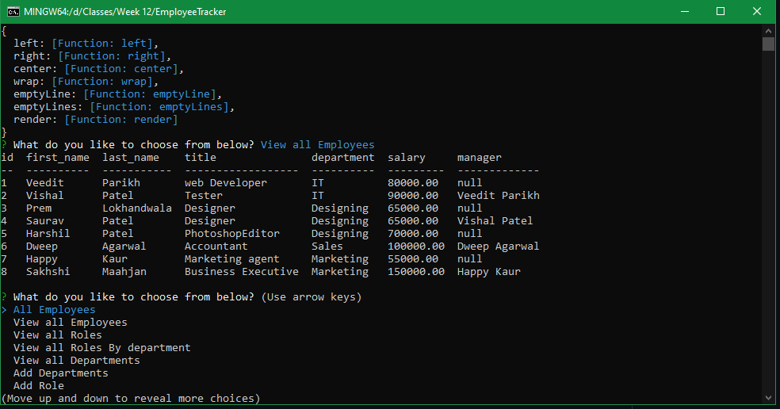

# EmployeeTracker
Employee traker mainly helps to add update delete data with the use of mysql database.
## Purpose

With the help of mysql and workbench to add, update, delete data and to use the CLI to show the table generated with the use of console.table dependency.
## Built With

mysql
console.table
express
inquirer
## Website

## Application

## Contribution

Made by Veedit Parikh